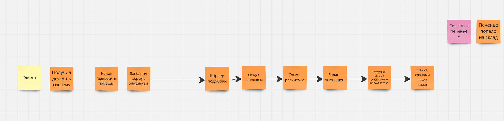
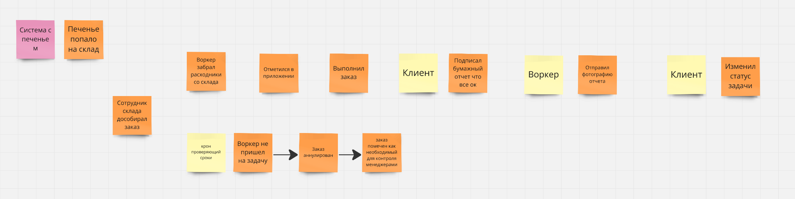
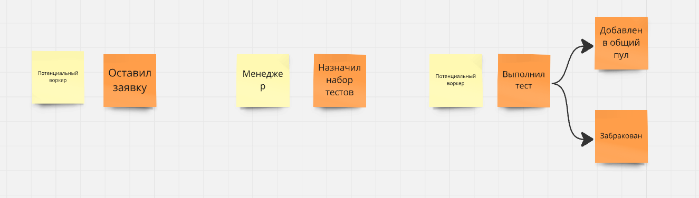
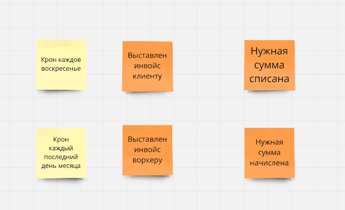
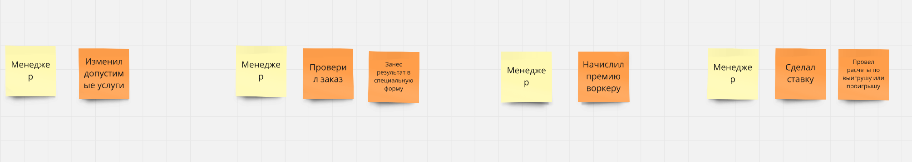

На первом шаге ES выделил события, немного сгруппировал их сразу по областям:

1) самая большая область это флоу заказа

2) далее идет система найма воркеров

3) платежи

4) функции менеджеров

