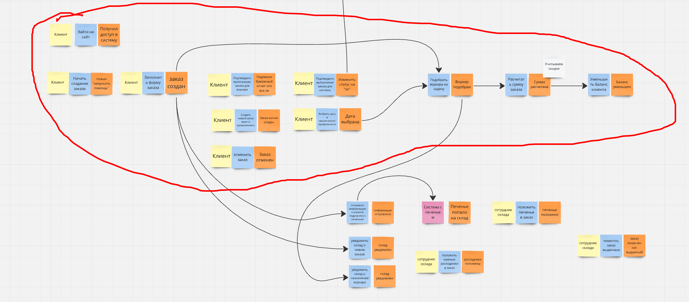

На втором шаге ES показалось что можно разбить основной флоу заказа по действующим лицам - клиент, воркер, работник склада, крон.

1) флоу заказа
   * с точки зрения воркера, есть стрелочка от части клиента т.к. завязка идет на отметку клиентом что заказ выполнен
      
   * флоу с точки зрения клиента   
      
   * флоу с точки зрения склада   
       
   * флоу с точки зрения крона   
      
2) найм
   
3) платежи
   
4) функции менеджеров
   