Для начала я немного изменил ES модель в отрыве от знаний второго урока, просто на основе разбора домашки первого урока. Я ее сдать не успел и ее не
проверяли, но я сам решил, что основные 2 проблемы это расположение флоу не слева направо и наличие технических деталей.
Также я вытянул весь процесс работы с заказом в длинную колбасу и сделал разделение по акторам по оси Y, так мне кажется более четко видны контексты.
Ну и разделение получается в рамках ES модели идет по пользователям.

Итоговая модель выглядит вот так (https://miro.com/app/board/uXjVPeG5wXM=/?moveToWidget=3458764593133586226&cot=14):
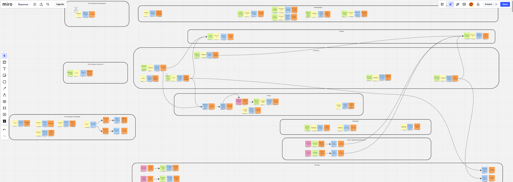
Так как получилось мелко, то ниже части по контекстам будут показаны отдельно.

Получилось 10 контекстов в рамках ES модели:
1. Регистрация менеджеров (ни с кем не связан, идет наравне с другими регистрациями, левее основного флоу)

2. Регистрация клиентов (ни с кем не связан, идет наравне с другими регистрациями, левее основного флоу)
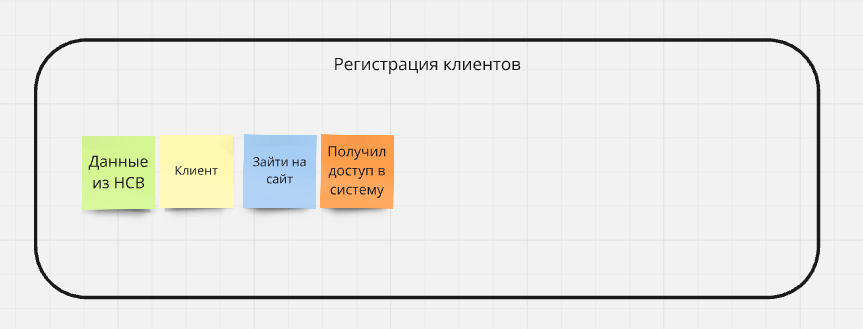
3. Регистрация воркеров (ни с кем не связан, идет наравне с другими регистрациями, левее основного флоу)
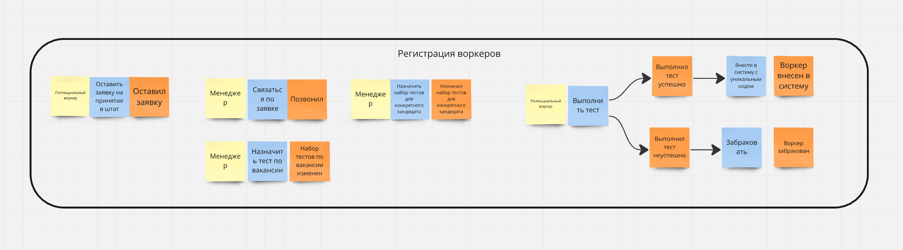
4. Контекст менеджеров. Часть с проверками идет после первого заказа в любом состоянии (тут отмена изображена).
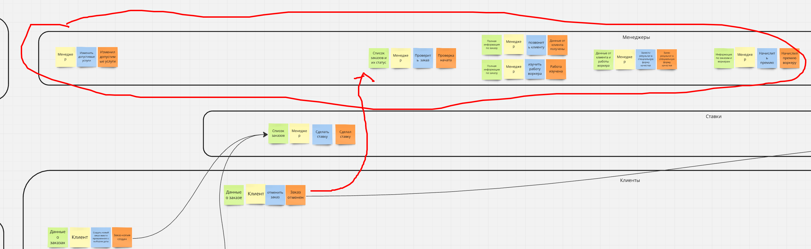
5. Контекст ставок. Часть с результатами идет после части с завершением заказа.
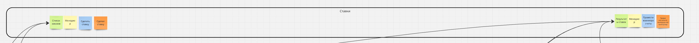
6. Контекст пользователей.
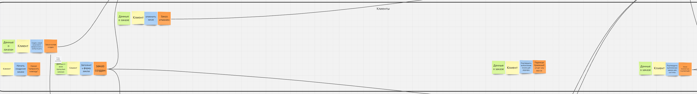
7. Контекст склада. Картинка ниже общая.
8. Контекст воркеров. Картинка ниже общая.
9. Контекст крона проверяющего заказ.
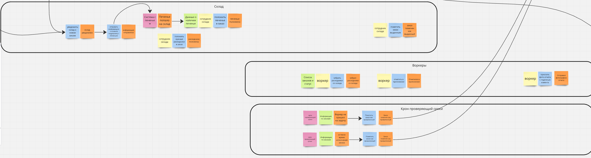
10. Контекст биллинга.
    * Первая часть, доступна сразу, периодические выплаты.
    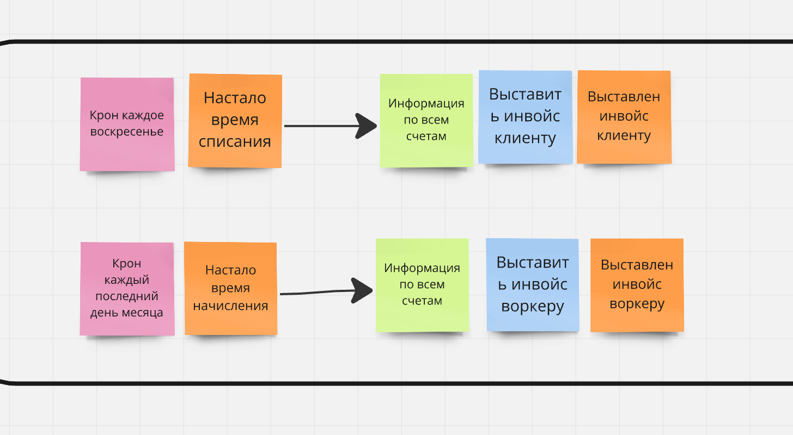
    * Вторая часть, доступна после завершения заказа
    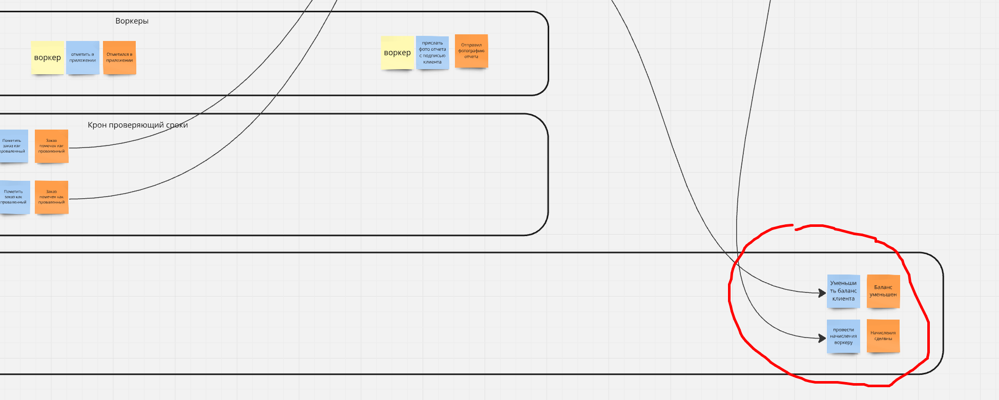

Теперь непосредственно к заданиям второй домашки.
## Задания 1/10 и 2/10 - поддомены
Выделил такие поддомены:
1. Тотализатор. Это вообще вспомогательный функционал, не связанный с основной бизнес-задачей продукта. Плюс для внутреннего 
использования. К тому же он в целом может жить вообще отдельно даже от данных системы - так как это сомнительная с точки зрения законодательства вещь
то в тотализаторе могут быть сущности не менеджеров и заказов, а неких пользователей (в которых мапятся менеджеры) и событий (в которые мапятся
заказы).
2. Отбор воркеров. Тоже кажется логически обособленный юнит - все что в нем происходит не связано с другими частями системы - нужно
просто как-то отобрать воркеров по внутренним правилам. Плюс попутно учитываем требование про ddos, хотя оно конечно не определяющее.
3. Клиенты. Кажется что взгляд на систему с точки зрения клиентов отличается и от менеджеров и от воркеров. Ну и язык на котором
бизнес описывает процесс с точки зрения разных пользователей будет разным. Сюда же можно отнести задачи по списанию денег.
4. Менеджеры.
5. Воркеры. По идее можно было бы объединить с поддоменом отбора, но мне все же кажется лучше разделить, так как разные задачи. 
В этом поддомене работа с уже зарегистрированными воркерами. Сюда же можно отнести задачи по начислению денег.
6. Сбор и хранение расходников.

## Задания 3/10 и 4/10 - типы поддоменов
У меня получилась такой график:
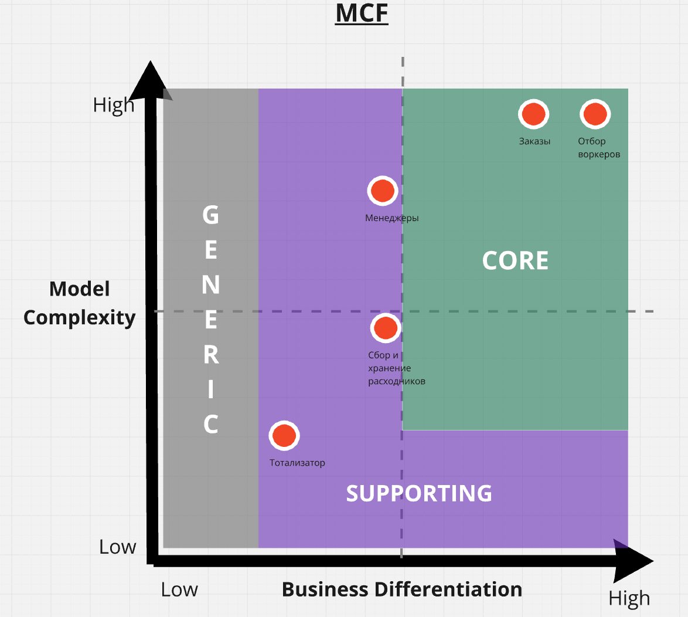
1. Я решил, что самые важные с точки зрения бизнеса поддомены это работа с клиентами (так как именно клиенты приносят деньги) и отбор воркеров
(потому что именно от того как хорошо мы их будем отбирать и зависит удовлетворение сервисом клиентов, то есть опять же деньги).
Поэтому два этих поддомена я поставил в верхний правый угол, я бы их вообще поставил в одну точку, но так будет не наглядно, поэтому пришлось рядом.
2. Часть с воркерами тоже по сути важная и сложная, но она не так влияет на прибыль бизнеса, поэтому я поставил сложность пониже, как индикатор того
что можно этот функционал делать командам послабее. Differentiation сделал ниже, даже несмотря на то что логика поддомена необычная, потому что
все равно это скрытая от посторонних глаз функциональность и не является определяющей для бизнеса.
3. Менеджерская часть это поддерживающий функционал, напрямую не влияет на работоспособность всего бизнеса.
4. Часть со сбором и хранением расходников посчитал тоже поддерживающей, несмотря на то что напрямую на работоспособность она влияет, можно для части
задач в целом попытаться воспользоваться какими-то готовыми решениями.
5. Ну и часть с тотализатором самая не важная, но к generic ее сложно отнести из-за специфических требований. Хотя в целом можно было бы найти 
какой-то готовый тотализатор и замапить наши сущности в сущности тотализатора - наши менеджеры стали бы участниками, а заказы - событиями.

## Задание 5/10 - боундед контексты
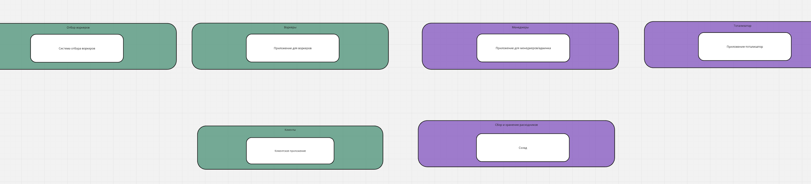
Получилось по одному контексту на каждый домен. Попытался подумать над тем может ли для каких-то поддоменов быть несколько контекстов, но не придумал.

## Задание 6/10 - расхождения
У меня получились небольшие расхождения - части с регистрациями из ES можно было бы вынести в поддомен.
Еще была часть в ES с кронами отслеживающими заказы, это по смыслу можно унести в воркерскую часть.
Ну и билинг тоже распадается на 2 части - воркерскую и клиентскую.
Расхождения получились думаю потому что с точки зрения последовательности действий части были независимы. Но с точки зрения людей которые будут 
заниматься поддержкой всего функционала и разбираться в области они связаны.

## Задание 7/10 - измененная схема.
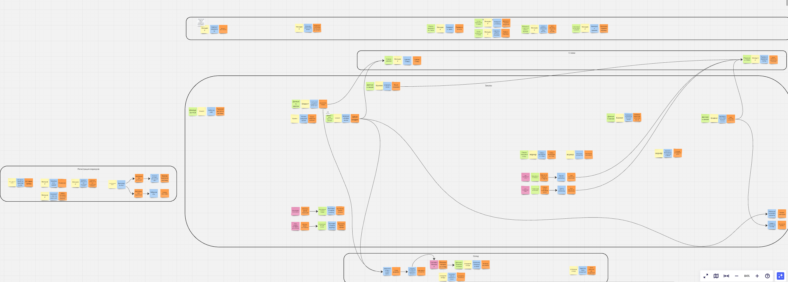
