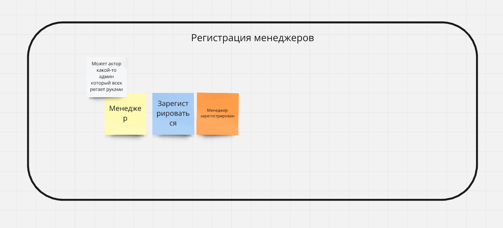
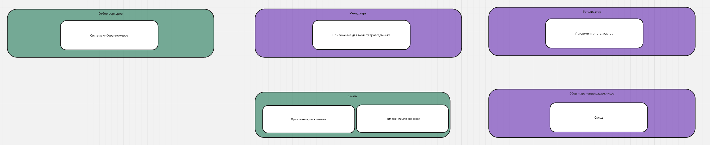

Для начала я немного изменил ES модель в отрыве от знаний второго урока, просто на основе разбора домашки первого урока. Я ее сдать не успел и ее не
проверяли, но я сам решил, что основные 2 проблемы это расположение флоу не слева направо и наличие технических деталей.
Также я вытянул весь процесс работы с заказом в длинную колбасу и сделал разделение по акторам по оси Y, так мне кажется более четко видны контексты.
Ну и разделение получается в рамках ES модели идет по пользователям.

Итоговая модель выглядит вот так (https://miro.com/app/board/uXjVPeG5wXM=/?moveToWidget=3458764593133586226&cot=14):

Так как получилось мелко, то ниже части по контекстам будут показаны отдельно.

Получилось 10 контекстов в рамках ES модели:
1. Регистрация менеджеров (ни с кем не связан, идет наравне с другими регистрациями, левее основного флоу)

2. Регистрация клиентов (ни с кем не связан, идет наравне с другими регистрациями, левее основного флоу)

3. Регистрация воркеров (ни с кем не связан, идет наравне с другими регистрациями, левее основного флоу)

4. Контекст менеджеров. Часть с проверками идет после первого заказа в любом состоянии (тут отмена изображена).

5. Контекст ставок. Часть с результатами идет после части с завершением заказа.

6. Контекст пользователей.

7. Контекст склада. Картинка ниже общая.
8. Контекст воркеров. Картинка ниже общая.
9. Контекст крона проверяющего заказ.

10. Контекст биллинга.
    * Первая часть, доступна сразу, периодические выплаты.
    
    * Вторая часть, доступна после завершения заказа
    

Теперь непосредственно к заданиям второй домашки.
## Задания 1/10 и 2/10 - поддомены
Выделил такие поддомены:
1. Тотализатор. Это вообще вспомогательный функционал, не связанный с основной бизнес-задачей продукта. Плюс для внутреннего 
использования. К тому же он в целом может жить вообще отдельно даже от данных системы - так как это сомнительная с точки зрения законодательства вещь
то в тотализаторе могут быть сущности не менеджеров и заказов, а неких пользователей (в которых мапятся менеджеры) и событий (в которые мапятся
заказы).
2. Отбор воркеров. Тоже кажется логически обособленный юнит - все что в нем происходит не связано с другими частями системы - нужно
просто как-то отобрать воркеров по внутренним правилам. Плюс попутно учитываем требование про ddos, хотя оно конечно не определяющее.
3. Заказы. Сначала я думал что стоит сделать разделение на клиентский и воркерский поддомен. Но мысль о том что на самом деле есть связь по данным 
(так как и клиенты и воркеры меняют заказы) натолкнула меня на идею о том что поддомен все же один. Также в этот поддомен войдет работа с платежами.
4. Сбор и хранение расходников.
5. Менеджеры.

## Задания 3/10 и 4/10 - типы поддоменов
У меня получилась такой график:

1. Я решил, что самые важные с точки зрения бизнеса поддомены это работа с заказами (так как именно заказы приносят деньги) и отбор воркеров
(потому что именно от того как хорошо мы их будем отбирать и зависит удовлетворение сервисом клиентов, то есть опять же деньги).
Поэтому два этих поддомена я поставил в верхний правый угол, я бы их вообще поставил в одну точку, но так будет не наглядно, поэтому пришлось рядом.
2. Менеджерская часть это поддерживающий функционал, напрямую не влияет на работоспособность всего бизнеса.
3. Часть со сбором и хранением расходников посчитал тоже поддерживающей, несмотря на то что напрямую на работоспособность она влияет, можно для части
задач в целом попытаться воспользоваться какими-то готовыми решениями.
4. Ну и часть с тотализатором самая не важная, но к generic ее сложно отнести из-за специфических требований. Хотя в целом можно было бы найти 
какой-то готовый тотализатор и замапить наши сущности в сущности тотализатора - наши менеджеры стали бы участниками, а заказы - событиями.

## Задание 5/10 - боундед контексты

Получилось по одному контексту на каждый домен за исключением заказов. Там думаю будет разделение на клиентскую и воркерскую часть потому что 
терминология по одному и тому же заказу с точки зрения воркера и с точки зрения клиента может быть разной.

## Задание 6/10 - расхождения
У меня получились такие расхождения:
1. Части с регистрациями из ES можно было бы вынести в поддомен.
2. Воркерскую и клиентскую часть стоит мне кажется объединить. Я не успел сделать модель данных, но очевидно что обе эти части будут менять заказы,
поэтому и стоит выделить.
3. Часть с кронами и биллинг тоже по смыслу можно вынести в заказный поддомен.

Меня только смущает что выделенная часть с заказами получилась слишком большой.

Расхождения получились думаю потому что с точки зрения последовательности действий части были независимы. Но с точки зрения людей которые будут 
заниматься поддержкой всего функционала и разбираться в области они связаны, плюс зависимость по данным (и клиенты и воркеры меняют один заказ).

## Задание 7/10 - измененная схема.
Ссылка https://miro.com/app/board/uXjVPeG5wXM=/?moveToWidget=3458764593161037839&cot=14

## Задание 8/10 - характеристики важные для проекта.
1. Поддомен с тотализатором. Учитывая US-250 ("Мы не ожидаем большого количества ставок из-за общего количества заказов") и US-260 ("Это не самый
критически важный проект для компании) характеристик особо никаких нет, можно написать "лишь бы работало".
2. Отбор воркеров.
Важны:
    * Availability и Scalability из-за требования US-081 про ддос. Надо иметь возможность быстро накинуть инстансов при необходимости и обеспечить
доступность сервиса.
    * Modifiability, Agility. Хотя нигде и не сказано про возможные изменения, с учетом US-080 где сказано про 3% лучших котов, и вообще учитывая цель
бизнеса, возникает понимание что это очень важный функционал в котором наверняка захотят делать много изменений, и нужно иметь возможность их быстро
делать.
3. Заказы.
Важны:
    * Availability - с учетом того что это основной функционал бизнеса, доступность должна быть максимально возможная.
    * Modifiability, Agility, Deployability - в работе заказов есть 2 важных места обеспечивающих конкурентное преимущество и которые наверняка будут 
часто меняться - назначение воркера на услугу (которое пока рандомное) и расчет цены (которая пока фиксированная). Нужно иметь возможность изменять 
эти части по требованию бизнеса.
    * Usability, Consistency, Simplicity - так как этот поддомен обеспечивает прибыль бизнеса, UX очень важен.
4. Сбор и хранение расходников.
Важны:
    * Availability, Maintainability так как от этого напрямую зависит основной функционал компании.
5. Менеджеры.
Важны:
    * Securability - так как это область системы для ограниченного числа пользователей и потенциально влияющая на остальную систему.
    * Agility - по мере развития системы наверняка будет хотеться добавлять все больше нового функционала для администрирования системы.